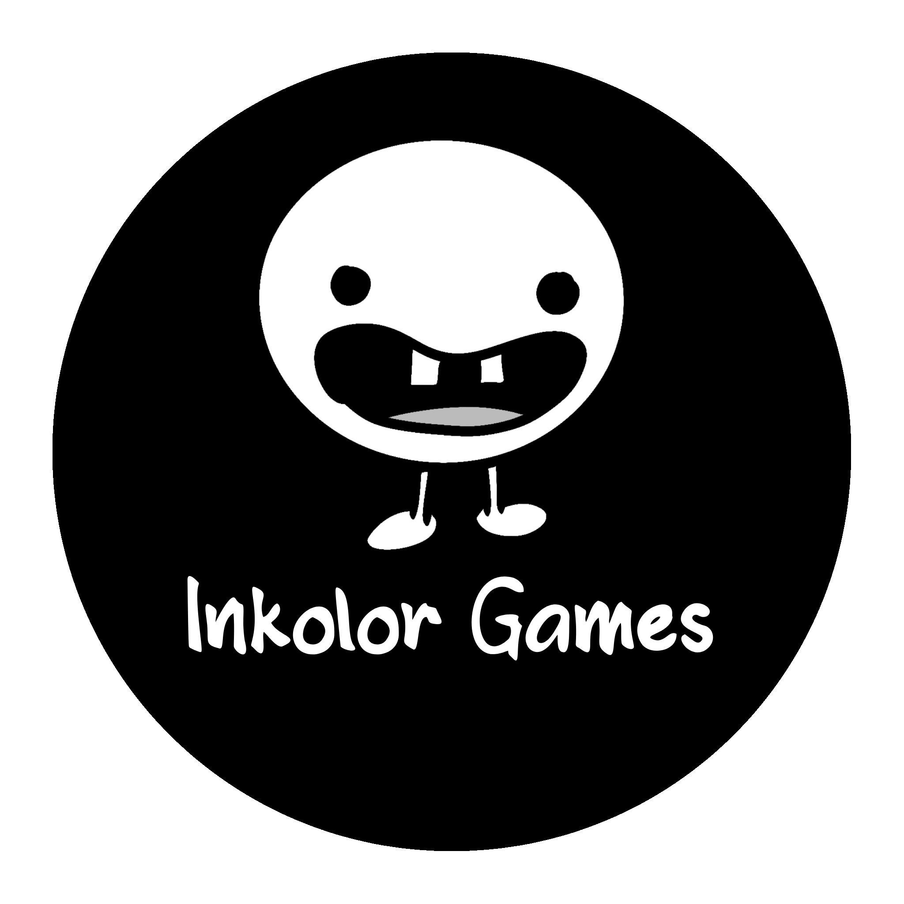

<section class="intro">
  

    
    
Indie game developer building tower-defense and idler games under the Inkolor label, focused on clean systems and getting the numbers right.

  

</section>

<section class="section">
  

    <h2>Projects</h2>

    

      <a class="project-card" href="/projects/paper-tower.html">
        <!-- same content -->
      </a>

      <a class="project-card" href="/projects/irezumi-defenders.html">
        <!-- same content -->
      </a>

      <a class="project-card" href="/projects/inkremental.html">
        <!-- same content -->
      </a>

    

  

</section>
